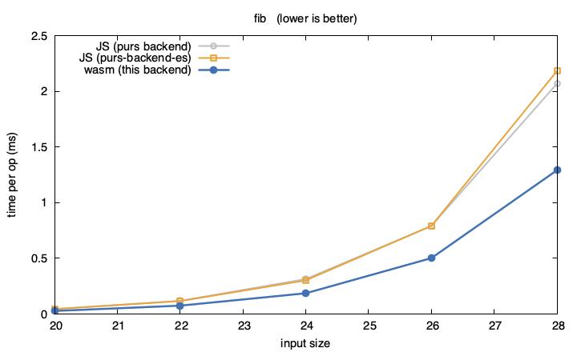
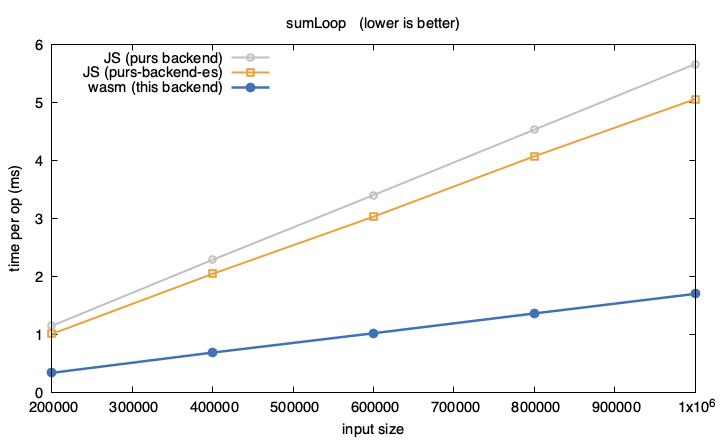
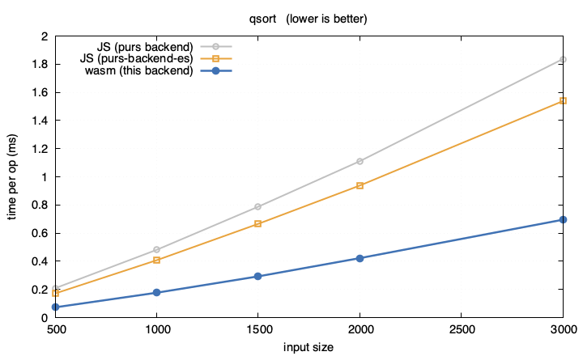
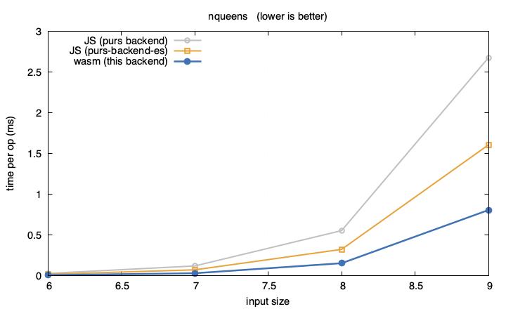
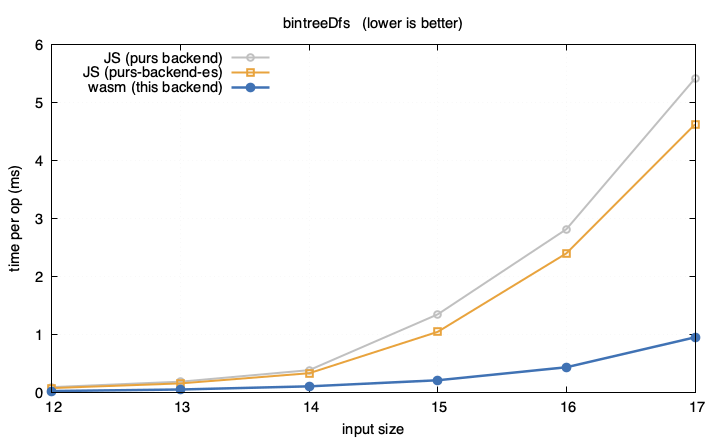
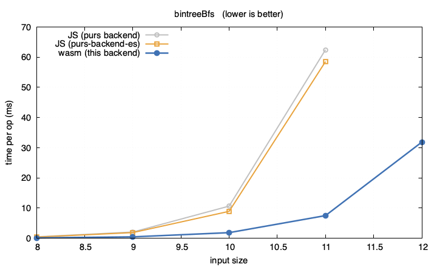

# PureScript Backend Wasm

An experimental WebAssembly backend for PureScript compiler

[](https://github.com/purescript/purescript/releases/tag/v0.15.15) [](https://github.com/katsujukou/purescript-backend-wasm/actions/workflows/ci.yaml)

## Overview

The compiler consumes `purs`'s CoreFn (`corefn.json`) and externs (`externs.cbor`)
output and produces a single WebAssembly module via the
[Binaryen](https://github.com/WebAssembly/binaryen) JS API. It targets **Wasm
GC**, so heap values (ADTs, records, closures) are reclaimed by the host VM.

Currenlty supported features are listed in 
[`docs/supported-features.md`](docs/supported-features.md).

Key architectural decisions are recorded as ADRs under
[`docs/design-decisions/`](docs/design-decisions/).

## WIP

- [x] [Higher-order functions](./docs/supported-features.md#closures-and-higher-order-functions) with [full-support for partial/over application](./docs/supported-features.md#function-application-partial-and-over)
- [x] [strings](./docs/supported-features.md#strings), [arrays](./docs/supported-features.md#arrays) and [records](./docs/supported-features.md#records)
- [x] [ADT and pattern matching](./docs/supported-features.md#algebraic-data-types-and-pattern-matching)
- [x] [Recursive let-bindings](./docs/supported-features.md#recursive-let-bindings)
- [x] [Basic typeclass resolution](./docs/supported-features.md#typeclass-dictionaries-not-optimized) (no cyclic dependencies like `Effect`'s Functor/Applicative/Monad instances')
- [x] Builtin support for `Prelude`
- [ ] Additional builtin support for curated packages (strings, arrays, records, etc)
- [ ] User-defined FFI (beyond the built-in intrinsics table)
- [ ] Special compiler support for `Effect` and `ST` monad
- [ ] Optimizations: unboxing, arity raising / uncurrying, nominal record layout,
      unboxed/immediate enum constructors (OCaml-style constant constructors)
- [ ] Multiple platform support (browser/node/native)

## Benchmarks

The **same PureScript source** compiled three ways and timed on one machine (lower
is better):

- **wasm** — this backend
- **JS (purs backend)** — `purs`'s stock JavaScript output
- **JS (with [purs-backend-es](https://github.com/aristanetworks/purescript-backend-optimizer))** — the optimizing JS backend

The wasm build is fastest on every benchmark, and completes the deep-recursion
`bintreeBfs` where both JS backends overflow the call stack (JavaScript has no
tail-call elimination). Reproduce with `cd bench && npm run graph`.

| | |
|:---:|:---:|
|  |  |
|  |  |
|  |  |

## Example

A small expression-language evaluator — an ADT, pattern matching, recursion, and
`Int` arithmetic (`example/src/Main.purs`):

```purescript
module Example.Main where

import Prelude

data Expr
  = Add Expr Expr
  | Mul Expr Expr
  | Neg Expr
  | Lit Int

eval :: Expr -> Int
eval = case _ of
  Add x y -> eval x + eval y
  Mul x y -> eval x * eval y
  Neg x   -> negate (eval x)
  Lit n   -> n
```

`eval` compiles to the wat below. The `Prelude` bundle (the `+` / `*` / `negate`
that lower to the `i32.add` / `i32.mul` / `i32.sub` intrinsics, plus the runtime
helpers) and the host `i32` export shim are elided to keep the focus on `eval`;
identifiers are given readable names and the output is lightly reformatted.

Note what is **not** there: no dictionary closures, no `call_ref`, and no
per-operation `Int` boxing. Arithmetic runs as unboxed `i32`, the four
constructors are dispatched by a direct tag test, and recursion is a direct
`call $eval`. (The middle-end eliminates the type-class dictionaries and unboxes
the arithmetic; see the [`Int`/`Number` unboxing](docs/design-decisions/0013-int-number-unboxing.md)
ADR.)

```wat
(module
 ;; Types (names added for readability; the optimiser emits numeric ids):
 ;;   $Expr = (struct (field i32) (field (ref $vals)))  -- an ADT: ctor tag + field array
 ;;   $vals = (array (mut eqref))                         -- the field array
 ;;   $Int  = (struct (field i32))                        -- a boxed Int
 (export "eval" (func $eval$export))

 ;; --- elided: the Prelude bundle (intAdd / intMul / intSub intrinsics, the
 ;;     negate helper, runtime helpers) and the host i32 export shim ---

 (func $eval (param $0 eqref) (result eqref)
  (local $1 (ref $Expr)) (local $2 eqref) (local $3 (ref $vals))
  (if (result eqref)
   (struct.get $Expr 0 (local.tee $1 (ref.cast (ref $Expr) (local.get $0))))     ;; read the ctor tag
   (then
    (if (result eqref) (i32.eq (struct.get $Expr 0 (local.get $1)) (i32.const 1)) ;; tag 1 = Mul?
     (then  ;; Mul x y  ->  eval x * eval y
      (local.set $3 (struct.get $Expr 1 (local.get $1)))                          ;; the field array
      (local.set $0 (array.get $vals (local.get $3) (i32.const 1)))               ;; y
      (local.set $2 (call $eval (array.get $vals (local.get $3) (i32.const 0))))  ;; eval x
      (local.set $0 (call $eval (local.get $0)))                                  ;; eval y
      (struct.new $Int (i32.mul                                                   ;; unboxed i32 multiply
       (struct.get $Int 0 (ref.cast (ref $Int) (local.get $2)))
       (struct.get $Int 0 (ref.cast (ref $Int) (local.get $0))))))
     (else
      (if (result eqref) (i32.eq (struct.get $Expr 0 (local.get $1)) (i32.const 2)) ;; tag 2 = Neg?
       (then  ;; Neg x  ->  negate (eval x)
        (struct.new $Int (call $negate
         (call $eval (array.get $vals (struct.get $Expr 1 (local.get $1)) (i32.const 0))))))
       (else
        (if (result eqref) (i32.eq (struct.get $Expr 0 (local.get $1)) (i32.const 3)) ;; tag 3 = Lit?
         (then  ;; Lit n  ->  n  (the field is already a boxed Int)
          (array.get $vals (struct.get $Expr 1 (local.get $1)) (i32.const 0)))
         (else (unreachable))))))))
   (else  ;; tag 0 = Add x y  ->  eval x + eval y
    (local.set $0 (array.get $vals (struct.get $Expr 1 (local.get $1)) (i32.const 1)))            ;; y
    (local.set $2 (call $eval (array.get $vals (struct.get $Expr 1 (local.get $1)) (i32.const 0)))) ;; eval x
    (local.set $0 (call $eval (local.get $0)))                                                    ;; eval y
    (struct.new $Int (i32.add                                                                     ;; unboxed i32 add
     (struct.get $Int 0 (ref.cast (ref $Int) (local.get $2)))
     (struct.get $Int 0 (ref.cast (ref $Int) (local.get $0)))))))))
```
