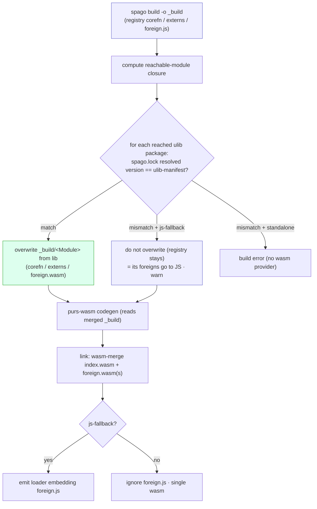

# 0031. ulib as a single library-module layer: last-wins artifact merge, retiring the shadow/wat duality

- Status: Accepted
- Date: 2026-06-11
- Supersedes: [0012](0012-ulib-curated-package-ffi.md) (its hand-written-`.wat`-as-general-provider mechanism), [0028](0028-ulib-library-layer-shadowing.md) (its in-code `shadowOrRegistry` per-module version match)
- Refines: [0029](0029-ulib-lib-distribution-and-purs-pinning.md) (precompiled lib + version pinning), [0026](0026-wasmbase-primitive-layer.md) (WasmBase)

## Context

ulib accreted **two parallel provider mechanisms for the same modules**:

- the **wat foreign layer** (ADR 0012): `ulib/<M>/foreign.wat`, hand-written wasm that satisfies a
  registry module's `foreign import`s;
- the **PureScript shadow** (ADR 0028): `ulib/shadow/<pkg>-<ver>/<Module>.purs`, a reimplementation
  over WasmBase that *replaces* the registry module's corefn when the user's version matches.

On top of that, a foreign could resolve four ways (`intrinsic` / `wat` / shadow-PS / JS fallback),
gated by an in-code `shadowOrRegistry` step that compared the user's resolved package version to the
shadow's target (major.minor). A *third*, independent path existed only for tests: the e2e harness
(`Test.E2E.*`) compiled **registry** modules directly and wired the **global wat layer** via
`ulibImports()` at instantiation. WasmBase (`Wasm.*`) grew ad-hoc (a late `Wasm.Int.lt`/`div`/`mod`),
and the UTF-8 codec was duplicated across the `CodeUnits` / `Common` / `Show` shadows.

The decisive signal: the **author** could not explain the shadow↔wat coexistence in one breath (a
user struggled with exactly this when reading the resolution flow). The concept count is the
problem. This record collapses the two mechanisms into one and moves module resolution out of code.

## Decision

A ulib module is **one PureScript module** that may FFI into a sibling `.wat` for the parts that
genuinely need hand-written wasm. "Shadowing" becomes a **last-wins merge of build artifacts**, not
in-code logic. Five sub-decisions:

### 1. One source shape — `ulib/{package}/{Module}.purs` (+ optional sibling `{Module}.wat`)

- The version is dropped from the path (it lives in the manifest, §4). No `shadow/` directory, no
  separate global wat layer.
- A module is PureScript over `Wasm.*`; the few operations that need hand-written wasm are declared
  `foreign import` and provided by a **sibling `{Module}.wat`** — naming that mirrors the PureScript
  convention "a module's `foreign.js` is the sibling of its `.purs`". Example:
  `ulib/prelude/Data.Show.purs` (showIntImpl/showCharImpl/showStringImpl/showArrayImpl in PS over
  `Wasm.String`/`Wasm.Char`/`Wasm.Array`) **+** `ulib/prelude/Data.Show.wat` (just `showNumberImpl`,
  a Dragon4 f64 formatter — a Ryu/Grisu-class algorithm that does not belong in PS).
- The interface stays registry-compatible (§ commands: verified by `ulib check` at install).

### 2. Precompiled lib — three artifacts per module

`ulib install` compiles each ulib module to `$LIB/<Module>/`, the precompiled distribution unit of
ADR 0029:

```
$LIB/
  ├─ ulib-manifest.json   # copied in at install — makes the lib self-describing (see Update below)
  └─ Data.Show/
     ├─ corefn.json       # the ulib corefn (showNumberImpl aside, everything is Wasm.* PS)
     ├─ externs.cbor      # interface-compatible with the registry module
     └─ foreign.wasm      # the sibling .wat, assembled (only showNumberImpl)
```

> **Update (2026-06-11):** `ulib install` also copies `ulib-manifest.json` into the **lib root**
> (`$LIB/ulib-manifest.json`). The precompiled lib is then **self-describing**: the build's version
> check / `shadowSet` (§4) and `ulib validate` read versions from the lib itself, needing no ulib
> *source* tree. This matters for the `ulib upgrade` user flow (a user may have only `$PURS_WASM_LIB`
> set, having pulled a prebuilt lib from upstream). `ulib install` reads the *source* manifest as its
> authoring input; every *consumer* reads `$LIB/ulib-manifest.json`. Lib scanners (`loadShadowMap`,
> `ulib check`/`validate`) filter the manifest file out, since it sits beside the module dirs.

### 3. Resolution = last-wins artifact merge (retires `shadowOrRegistry`)

The in-code per-module shadow/registry decision is replaced by a file-copy step *before* codegen:

1. `spago build -o _build` → registry-based `corefn.json` / `externs.cbor` / `foreign.js`.
2. For each module that is **reachable** *and* **ulib-covered** *and* **version-matched** (§4),
   overwrite `_build/<Module>/` from `$LIB` (corefn / externs / foreign.wasm). The registry
   `foreign.js` is left in place (it provides the kept foreigns on the JS platform).
3. purs-wasm codegen reads the **merged** `_build`; it never knows about ulib. (`Wasm.*` references
   resolve to intrinsics, so no `wasm-base` corefn is needed in `_build`.)
4. Link: `wasm-merge` the app `index.wasm` with each `foreign.wasm`. On the JS-fallback platform the
   loader embeds the remaining `foreign.js`; standalone / `--no-js-fallback` ignores it.

This is the central simplification: module provenance is decided by **which files won the merge on
disk**, not by branching logic in the compiler.

### 4. Version policy — `ulib-manifest.json` is the single source of truth

```json
{ "prelude": { "version": "6.0.2", "modules": ["Data.Show", "Data.Ord", "..."] },
  "strings": { "version": "6.0.1", "modules": ["Data.String.CodeUnits", "..."] } }
```

- **No package-set ID or range is pinned.** The only input the check needs is the user's resolved
  versions, read from `spago.lock`. purs-wasm therefore supports *any* package-set whose
  ulib-covered packages sit at the manifest versions.
- **Pay for what you use.** From the entry's reachable-module closure, keep the modules that appear
  in `ulib-manifest`, map each to its package (the manifest's `package → [modules]`, reversed), and
  check **only those reached packages'** versions. An unused package's version mismatch is ignored.
- Behaviour on a reached ulib package whose resolved version ≠ manifest:

  | platform | behaviour |
  |---|---|
  | js-fallback enabled | **graceful**: do *not* overwrite (registry corefn stays) → its foreigns go to JS; **warn** that those modules are not standalone. |
  | standalone / `--no-js-fallback` | **build error** (the registry foreign has no wasm provider) with an actionable message ("prelude is X; ulib supports 6.0.2 — align the package-set or enable js-fallback"). |
  | version matches | apply ulib (overwrite). standalone-capable. |

- A hard error happens **only** when standalone is requested *and* a reached ulib package mismatches.
  Otherwise degradation is graceful and per-package (e.g. `Data.Array`=ulib while `Data.Show`=registry
  in one build — the merge is per-module directory, so the mix does not break codegen/link). The
  notion of a single "supported package-set" disappears.
- Users not on spago (no `spago.lock`) are out of scope for this check.

### 5. Two CLIs — a lean user surface, a separate maintainer tool

The user-facing and maintainer-facing surfaces are **split into two CLIs**, so the user binary stays
minimal (and eventually self-hostable) and the heavy authoring / registry machinery never ships to
users.

**User CLI (`purs-wasm`)** — all an end user touches:

- **`build`** — the pipeline (§3), with the version check (§4) built in.
- **`ulib upgrade`** — fetch the latest ulib from upstream and refresh the local `$PURS_WASM_LIB`,
  run when purs-wasm has (a) tracked a supported package's version bump or (b) widened the
  ulib-covered set — so the user picks up the change *without reinstalling the binary*. It is the
  remedy the build-time check (§4) points to ("prelude is newer than the installed ulib — run
  `ulib upgrade`, or align the package-set"). Whether it pulls prebuilt artifacts or sources+rebuilds
  follows the ADR 0029 distribution channel. The user binary only *consumes* the precompiled lib — it
  carries no purs / registry tooling.

**Maintainer CLI (a separate monorepo package, e.g. `tooling/ulib`)** — purs-wasm devs / CI only:

- **`install`** — compile the ulib sources (`ulib/{package}/{Module}.purs` + sibling `.wat`) to
  `$LIB/<Module>/{corefn,externs,foreign.wasm}` and run `check`. The build primitive behind the
  shipped lib (the nix derivation / npm package).
- **`check`** — interface compatibility: each ulib module's externs == the registry module's. Run at
  install (the nix Check phase).
- **`track`** — bump a package's targeted version: re-resolve its registry sources, recompile the
  ulib modules against them, re-run `check`, and update `ulib-manifest.json`. A `check` failure means
  the registry interface moved and the `.purs` needs a matching edit. (Replaces the registry-querying
  `ulib-compat.mjs`.)
- **`publish`** — package the built lib for the distribution channel (npm / nix).

`ulib-manifest.json` is the curated source of truth, maintained via `track`; the build-time version
check (§4) is part of the user CLI's `build`. The old in-`purs-wasm` `validate` / `compat` subcommands
and the scattered `*.mjs` maintainer scripts are retired.

### 6. Internal helper modules — plan, recompute, materialize

A ulib module may want a **private helper module** that is not a registry module — e.g. the UTF-8
codec (`decodeAt` / `sliceBytes` / `byteIndexOf`) shared by `Data.String.CodeUnits` and
`Data.String.Common`, factored into `Data.String.Internal.Utf8`. This breaks the naive "substitute a
registry module in place" model: after `Data.String.CodeUnits` is taken from the lib, its corefn
references `Data.String.Internal.Utf8`, but that module is in neither the user's reachable closure
(the user never imports it) nor the registry — a **dangling reference** at codegen.

(Note the contrast: a shadow importing another *registry* module — `Data.String.CodePoints` →
`Data.String.CodeUnits` — already works, because both are in the user's closure and both get
resolved. Only a non-registry helper is missing. And `Wasm.*` is fine because it is **intrinsics, not
modules** — no corefn to link.)

The fix is to let the lib **inject** such modules into the build, via a three-step resolution that
keeps the cheap import-list domain separate from the expensive materialization (mirroring the
existing reachability-prune-then-decode two-phase shape):

1. **Dependency graph** — read import lists from the user's `output/` (cheap, raw corefn).
2. **Shadowing plan** — pure decision per module: `lib` (reached ∩ covered ∩ version-matched, §4) or
   `user`. Still only import lists, no full parse.
3. **Recompute the graph under the plan** — re-walk imports, but for a `lib`-planned module use the
   **lib** corefn's import list. An import that is absent from the user's `output/` yet present in the
   lib is an **internal module** (`B'`): add it, always sourced from the lib, and walk *its* lib
   imports too. Iterate to a fixpoint.
4. **Materialize** — once, on the converged set: load each module's corefn + externs from its planned
   source (lib or user). Internal modules are read wholly from the lib.

The plan and the graph are strictly **mutually dependent** (a lib corefn may pull in a registry
module the user's version did not, which may itself be covered → shadowed). But "reached" only grows
and the version match is static per package, so a module's source, once decided, never flips — the
fixpoint is **monotone and terminates**. The version policy (§4) applies only to registry
**packages**; an internal module rides in transitively because a shadowed module imports it, with no
version of its own.

This is exactly the in-code form of §3's file merge ("copy the lib modules into `_build` — overwrites
*and* additions — then recompute reachability"), so building it now is a step **toward** the final
architecture, not scope outside it. Naming convention: internal modules live under an `*.Internal.*`
namespace so they never collide with a registry module name.

#### 6.1 Kept-foreign signatures ship in the lib

A kept foreign's **wasm calling convention** (e.g. `Data.Array.rangeImpl`'s `(param i32)`) is the hand
author's choice, encoded in the co-located `.wat`; externs carry only the PureScript type, so the
marshalling for unboxed-`Int` / polymorphic foreigns cannot be reconstructed from them. The build
therefore reads each kept foreign's signature from its `.wat`. To keep the build self-contained (no
ulib *source* tree — the `ulib upgrade` user flow), `ulib install` ships the co-located `.wat`
verbatim into the lib as **`$LIB/<Module>/foreign.wat`**, beside the assembled `foreign.wasm`, and
`ForeignSigs` parses it from there. The raw `.wat` (not a `wasm-dis` of `foreign.wasm`) is shipped
because the parser keys on the one-line `(func (export "…") (param …) (result …))` form, which the
disassembler does not preserve (it emits `(export "…" (func $n))` separately from the typed func).
This makes `$LIB/<Module>/` carry `{corefn, externs, foreign.wasm, foreign.wat}` for a module with a
kept foreign; the `.wat` is the sig source, the `.wasm` the merged provider.

### e2e tests

The harness's separate "registry modules + global wat layer (`ulibImports`)" path is removed. e2e
runs **real user-scenario fixtures through the actual build pipeline** (§3), so there is one path,
not three — the build users run is the build tests exercise.

## Resolution flow



## Consequences

**Removed**

- `PursWasm.CLI.Ulib.Shadow` (`shadowOrRegistry` / `loadShadowMap`) — provenance is now the on-disk
  merge.
- the `ulib/shadow/<pkg>-<ver>/` tree → `ulib/{package}/{Module}.purs`.
- the global wat layer `ulib/<M>/foreign.wat` *as a general registry provider* → per-module sibling
  `{Module}.wat`, assembled into `$LIB/<Module>/foreign.wasm` (kept-foreigns only).
- `compat.json` + `ulib-compat.mjs` → `ulib-manifest.json` (maintainer-curated) + the build-time
  check; the user refreshes their local `$PURS_WASM_LIB` with `ulib upgrade`.
- the e2e harness's `ulibImports()` and its independent registry+wat path.
- the `resolveForeign` ulib-wat branch (providers come from the merged `$LIB` `foreign.wasm`).

**Preserved / changed**

- WasmBase (`Wasm.*`) remains the first-order primitive layer the ulib PS builds on; this is the
  moment to write down its growth rule (first-order only; added deliberately and always paired with
  an `Intrinsics` entry) and tidy stragglers (`Wasm.Boolean`).
- Graceful degradation changes shape: previously a version mismatch still produced standalone wasm
  (via the wat layer); now it falls back to the **registry corefn → JS foreign** (standalone is lost
  for those modules). Accepted as the cost of dropping the duplicate provider.
- standalone capability, closure specialization (ADR 0027), and registry interface compatibility are
  unchanged.
- `ulib check` keeps its value (interface guard) and runs at install.
- ~~the duplicated UTF-8 codec across `CodeUnits` / `Common` / `Show` is consolidated into a
  shared internal (non-exported) module during the migration.~~ *(refined — see §6 and the
  2026-06-11 Update below: `Show` is out of scope; the codec shared by `CodeUnits` / `Common` moves
  to an injected `*.Internal.*` module.)*

**Confidence basis**

The retired `bin` byte-for-byte differential is *not* reintroduced. Correctness rests on **real
user-scenario e2e** (through the one build pipeline) **plus `ulib check`** (interface). The
per-module mix (some ulib, some registry-fallback in one build) is guaranteed by the resolution
invariant "a module's provenance is independent of who imports it" and is verified by an e2e
fixture in the migration.

**Migration (single-concern PRs; every step keeps the suite green)**

1. Add `ulib-manifest.json`; at build, check reached ulib packages' versions against it — **warn
   only**, no behaviour change (lays the new rail beside the old one).
2. Implement the last-wins merge pipeline (`_build` overwrite + codegen) **alongside** the existing
   `shadowOrRegistry`, diffing the two; add the per-module-mix e2e fixture.
3. Relocate ulib sources (`ulib/shadow/<pkg>-<ver>/X` → `ulib/{package}/X.purs`), co-locate the wat,
   and make `ulib install` emit `$LIB/<Module>/{corefn,externs,foreign.wasm}`.
4. Delete the old path: `shadowOrRegistry` / `loadShadowMap` / the global-wat resolution.
5. Move e2e to real-scenario fixtures on the real pipeline; remove `ulibImports`.
6. **Split the CLIs**: extract the maintainer ops into the separate `tooling/ulib` CLI
   (`install` / `check` / `track` / `publish`), reduce the user `purs-wasm` to `build` +
   `ulib upgrade`, and retire the in-`purs-wasm` `validate` / `compat` subcommands + the scattered
   `*.mjs` scripts. Consolidate the UTF-8 codec; tidy WasmBase.
7. Promote this record's status notes and integrate the supersession into ADRs 0012 / 0028 / 0029.

> **Update (2026-06-11):** phases 1 & 2 implemented. Phase 2 was **refined** to avoid building a
> throwaway parallel pipeline: rather than running the `_build`-overwrite merge + codegen *alongside*
> `shadowOrRegistry` (which would mean a second codegen per build, or a full input copy, purely for a
> diff), the new resolution is captured as a pure function `Ulib.Manifest.shadowSet` (reached ∩
> covered ∩ **exact** version match) and **diffed against the legacy `shadowOrRegistry` decision at
> debug level** (`Build.debugResolutionDiff`) — a migration regression guard that surfaces where the
> legacy `major.minor` match and the new exact match disagree (e.g. a patch bump). It is dormant
> in-repo (the sets agree). The **actual `_build` merge pipeline + the codegen switch** and the
> **per-module-mix coverage** therefore move into **phase 4 (the switch)**, where the existing test
> suite is the byte-equivalence check and the mix to test becomes the new *graceful → JS* fallback
> (mixes of shadow + registry modules are already exercised pervasively by every example build, so
> forcing one *in-repo* added little; it is meaningful once the merge drives the build). So phase 4
> now reads: build the `_build` last-wins merge + switch codegen to read it + delete
> `shadowOrRegistry` / `loadShadowMap` / global-wat resolution, with the suite proving equivalence,
> and add the forced graceful-fallback per-module-mix e2e fixture.

> **Update (2026-06-11):** added **§6 (internal helper modules)**. Consolidating the UTF-8 codec
> revealed that a shadow cannot depend on a non-registry helper without the lib **injecting** it into
> the build (else a dangling corefn reference). The resolution is the plan → recompute → materialize
> fixpoint of §6 — which is also the in-code form of §3's file merge, so it is forward progress, not
> new scope. This **corrects** the "Preserved / changed" codec bullet: `Show` is **out of scope** (it
> sits in the `prelude` layer and must encode via `Wasm.Int` to dodge the `Data.Ord`/EuclideanRing
> import cycle, so it cannot share a `strings`-layer module); only `Data.String.{CodeUnits,Common}`
> share the codec, via an injected `Data.String.Internal.Utf8`. Sequencing: the injection machinery
> (§6) lands first as its own step, then the codec extraction rides on it.

> **Update (2026-06-11):** phases 1–4 done; the product no longer reads the ulib source tree (sigs +
> `_header.wat` ship in the lib). **Phase 5 started (e2e → real pipeline)**, executed incrementally:
> the legacy in-process corefn-fixture runner (`Test.E2E.Wasm` + `ulibImports`, ~45 suites) is
> **renamed `Test.E2E.Legacy` and kept running** for coverage, while a new **CLI-driven** runner
> (`Test.E2E.Cli`) instantiates each fixture's *prebuilt standalone wasm* — `e2eCliPrebuild.mjs` runs
> the real `purs-wasm build` over a new `e2e-fixtures` package, so there is no separate link path and
> no `ulibImports` (instantiated with `{}`). `test:e2e` = `legacy && cli`. Suites migrate batch by
> batch (real `.purs` fixtures, reusing the legacy `.purs.sample` sources); once `Test.E2E.Cli` covers
> everything, the legacy runner, the global `ulib/<M>/foreign.wat` layer, and `build-ulib.mjs` retire
> together — collapsing "three paths" to one. Host-FFI suites (`FFI`/`HostEff`/…) need import wiring in
> the new harness and migrate in a later batch.

> **Update (2026-06-11):** **phase 5 complete — "three paths → one."** The legacy in-process
> corefn-fixture e2e runner (`Test.E2E.Legacy` + the `Test.E2E.Wasm` harness with `ulibImports`) and
> all its suites are deleted; `Test.E2E.Cli` (real `purs-wasm build` over the `e2e-fixtures` package,
> 144 tests) is the only e2e. The **global `ulib/<M>/foreign.wat` layer and `build-ulib.mjs` are
> removed** — nothing reads them anymore (the product moved to the lib in phase 4; `showNumber.mjs`
> now drives the `E2E.ShowNumber` fixture through the loader). `test:e2e` = the CLI suite; `build:ulib`
> is gone from every script (`test:bin` / `test:shownumber` / bench). One gap surfaced and is deferred
> (~~**record host-marshalling** does not round-trip through the real loader (the CLI derives an opaque
> `Object` kind for a record foreign, and `internStr` is exported only for record *export* sigs, not
> *import* sigs) — the legacy harness had masked it.~~ **Fixed 2026-06-12 — see the Update at the end of
> this record;** the root cause was narrower: only *type-synonym*-typed record foreigns fell to opaque).
> String / Array / closure / Boolean / Number /
> nullary / Effect host-FFI all work end to end. Co-located `ulib/{package}/{Module}.wat` sources, the
> lib's `$LIB/<Module>/foreign.wat` (sig source, §6.1), and `_header.wat` are untouched.

> **Update (2026-06-11):** **phase 6 done — the CLIs are split.** The user binary `purs-wasm` now
> exposes only `build`; the maintainer ops moved to a new one-level package **`ulib-tooling`**
> (`install` / `check` / `compat`) with its own `Main` / `Options` / `index.dev.js` / `ulib-install.sh`,
> depending on `purs-wasm` for the shared infra (effect layer, `Ulib.Manifest`, `Ulib.Shadow`,
> `Externs`, `Build.Paths`) so the maintainer machinery never ships in the lean user binary. `Ulib`
> (→ `UlibTooling.Commands`), `Ulib.Compat`, `Ulib.Compat.Types`, `Ulib.Version` moved out;
> `validate` was **retired** (the build-time check, §4, covers it). Call sites that build the lib now
> run `spago build -p ulib-tooling` (which also builds `purs-wasm`) + `node ulib-tooling/index.dev.js
> install`; CI gained a `ulib-tooling` matrix leg. Deferred: the user `ulib upgrade` op, and `compat`
> → `track`/`publish` (ADR §5) — future work, fine to do at the first post-release ulib version bump.

> **Update (2026-06-12):** **migration complete (phases 1–7).** Phase 6 split the CLIs (above);
> phase 7 promoted the cross-references — [0028](0028-ulib-library-layer-shadowing.md) is marked
> *superseded* by this record (its in-code `shadowOrRegistry` is gone), [0012](0012-ulib-curated-package-ffi.md)
> *further superseded* (the global wat layer is gone), and [0029](0029-ulib-lib-distribution-and-purs-pinning.md)
> *refined* (manifest-driven exact-version policy + `ulib-tooling compat`). The README index reflects
> these. Remaining follow-ups are outside this migration: the deferred user `ulib upgrade` op, `compat`
> → `track`/`publish`, and the surfaced record host-marshalling bug.

> **Update (2026-06-12):** the **record host-marshalling gap** flagged in the phase-5/7 notes is
> **fixed** (it was tangential to the ulib migration — surfaced by the real-pipeline e2e). Root cause:
> a foreign typed by a *type synonym* (`type Point = { … }`) kept the alias unexpanded in externs, so
> `Externs.marshalKind` derived `MOpaque` and the loader trapped; inline record types always worked.
> `foreignSigs` now builds a nullary-synonym table and `marshalKind` expands it. Guarded by
> `Test.E2E.Cli.ForeignRecord`. Residual: parameterized record synonyms + the ADR-0016 source-foreign
> path still do not expand (minor).
